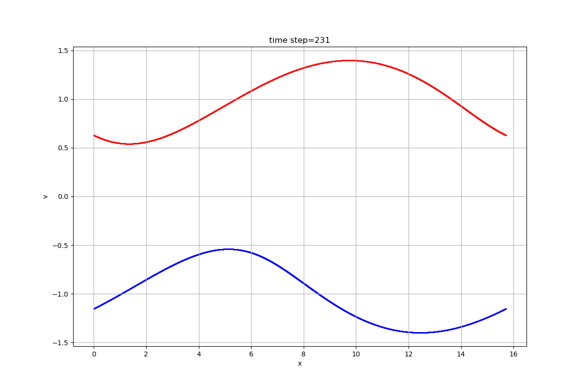
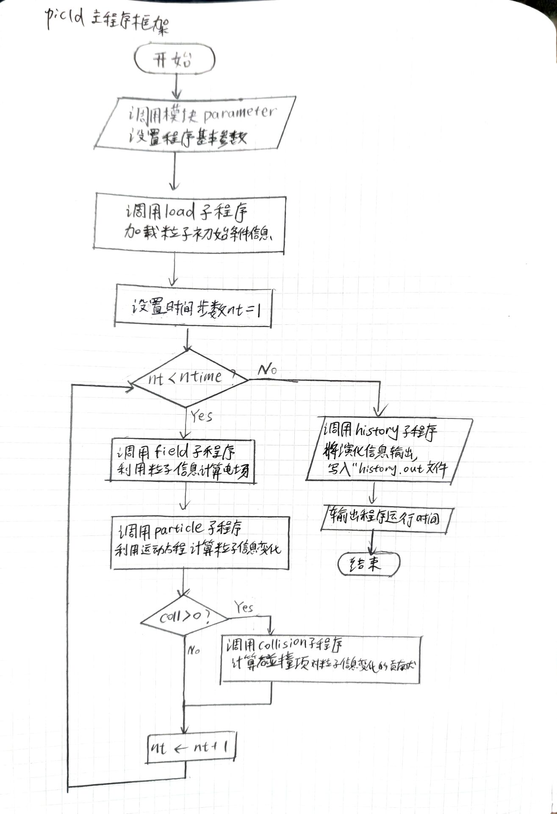
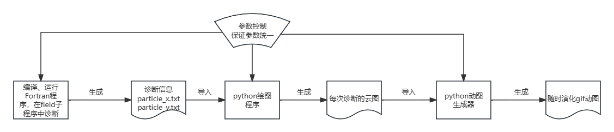
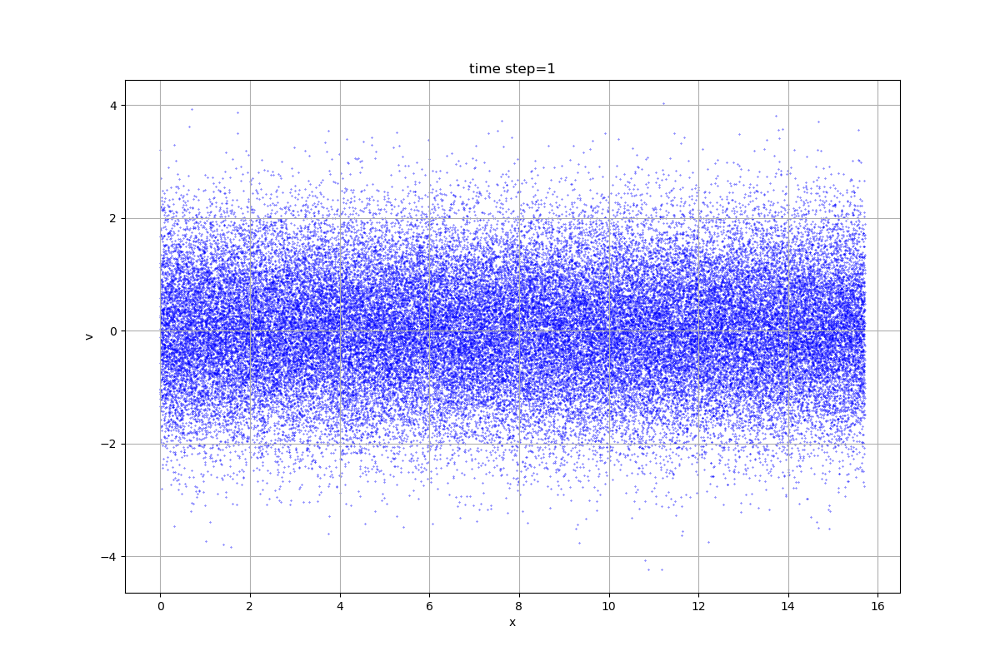

## PIC1D主程序算法框架

1. **初始化阶段**：
   - 设置模拟参数：时间步长、总模拟时间、网格大小、粒子数量等。通过调用模块parameter实现
   - 随机分布粒子在1D空间中，并赋予初始速度或其他物理量。通过加载子程序load实现。
     - load原本加载了电子和离子的麦克斯韦玻尔兹曼分布，**调整后可实现电子的双delta函数分布，即双流。**
2. **主循环（迭代过程）**：
   - ​	主循环采用二阶龙格库塔法，交替计算场和粒子。
     - 通过field模块根据此时刻粒子位置计算电荷密度分布，从而计算静电场分布；
     - 通过particle模块计算每个粒子收到场的作用，推算粒子在下一时刻位置、速度变化。
3. **输出**
   - 分散在程序许多地方，记录信息用于诊断
   - 可以通过其它软件（如python）读取信息并绘图


主程序流程图。需要注意的是，与原始程序相比，流程图做了细微的调整：field和particle子程序接受参数nrk输入，相当于在particle子程序末添加一段周期性边界条件处理程序。

## 诊断与粒子云图绘制
在原程序中，诊断过程在field子程序中进行，history将诊断变量输出。现在，我们可以不适用原始的history子程序；针对我们感兴趣的粒子云图，我们可以自己写诊断方案，将粒子信息保存在文本文件中，然后利用第三方软件（如python）进行粒子云图绘制。


在field子程序中，每次诊断，我们记录每个电子的x，v信息：

```fortran
open(partfx,file='particle_x.txt',status='replace')
open(partfv,file='particle_v.txt',status='replace')
k=1 !只记录电子
do i=1,nparticle
    !记录所有粒子信息
    write(partfx,102)x(i,k)
    write(partfv,102)v(i,k)
enddo
102 format(e14.5)
```
在python绘图程序中，我们读取记录下的文本文件，然后针对每次诊断，绘制成散点图，保存。
```python
# 指定文件名  
filex = 'particle_x.txt'  
filev = 'particle_v.txt'  
  
# 读取数据文件  
with open(filex, 'r') as fx, open(filev, 'r') as fv:  
    arx = np.loadtxt(fx)  
    arv = np.loadtxt(fv)  

#...(设置参数、保存路径)

# 循环遍历每个诊断并生成散点图  
for idiag in range(1, ntime // ndiag + 1):  
    start_idx = (idiag - 1) * nparticle  
    end_idx = idiag * nparticle  
    #mystep=10 #每隔mystep个点选一个点
  
    plt.figure(figsize=(12, 8), dpi=100)  
    marker_size = 0.1  
    plt.scatter(arx[start_idx:end_idx:mystep], arv[start_idx:end_idx:mystep], s=marker_size, color='blue')  
    #...设置图例、保存

```
对于生成的许多张诊断图，我们利用python的imageio库，将其拼接为gif动图：
```python
# 获取子文件夹中所有PNG文件的路径  
image_paths = [os.path.join(os.getcwd(), subfolder, f) for f in os.listdir(os.path.join(os.getcwd(), subfolder)) if f.endswith('.png')]  
  
# 排序文件路径，确保它们按数字顺序排列  
image_paths.sort(key=lambda x: int(os.path.splitext(x)[0].split('_')[-1]))  
  
# 使用imageio保存为GIF  
with imageio.get_writer(os.path.join(os.getcwd(), 'scatter_animation_nparticle_{:d}_ntime_{:d}_ndiag_{:d}.gif'.format(nparticle,ntime,ndiag) ), mode='I', fps=fps) as writer:  
    for path in image_paths:  
        image = imageio.imread(path)  
        writer.append_data(image)  
```
##Maxwell分布下电子相空间演化
###涉及程序
主要程序保存在文件夹 maxwell_particle_evolution中。
fortran程序：pic1d_diy_2_full_more_explain.f90 
python绘制粒子云图程序：py_readparticle_many_picture.py
python动图绘制程序：py_imageio_combine2gif.py

###参数和初始条件设置
设置两种粒子：电子和离子。之后用k表示粒子种类，其中k=1是电子，k=2是离子。参数如下：
```fortran
    real,dimension(nspecie) ::  qspecie,aspecie,tspecie
    data qspecie/-1.0,1./         !charge
    data aspecie/1.0,100./          !mass
    data tspecie/1.0,1./          !temperature
```
采用full_f和非线性模拟。初始粒子速度在load子程序中设置，默认设为Maxwell分布。
模拟主要调节参数：模拟每种粒子数量nparticle,模拟时间步进次数ntime,诊断频率(每隔多少时间步长诊断一次)ndiag.对于`nparticle=60000,ntime=5000,ndiag=20`情况，绘制动图如下。

初始时刻图如下。对比可见，此情况下演化，相空间变化不大。这是对平衡情况验证。


## 双流初始条件下的演化

### 初始速度的设置

首先我们在parameter中声明了我们的粒子数量，离子和电子均为`nparticle=60000`。然后我们设置`nbeam`为双束流电子总数。

每个粒子的速度信息保存在二维数组v里，`v(i,k)`表示第k种第i个粒子的速度。子程序`load`中，源代码在`imarker==1`时进行速度的麦克斯韦分布：

```fortran
call random_number(v(:,k))
        if(imarker==1)then ! Maxwellian distribution

            ! marker weight defined as p == f/g, f is physical PDF, g is marker PDF
            p0(:,k)=1.0

            ! transform uniform random number to Gaussian with variance=1
            v(:,k)=v(:,k)-0.5
            va(:,k)=sign(1.0,v(:,k))
            v(:,k)=sqrt(max(small,log(1.0/max(small,v(:,k)*v(:,k)))))
            v(:,k)=v(:,k)-(c0+c1*v(:,k)+c2*v(:,k)*v(:,k))/&
                (1.0+d1*v(:,k)+d2*v(:,k)*v(:,k)+d3*v(:,k)*v(:,k)*v(:,k))
            v(:,k)=va(:,k)*v(:,k)

        elseif(imarker==0)then ! uniform loading for [-vmax,vmax]
            ! marker weight p=exp(-v^2/2)
            v(:,k)=2.0*vmax*(v(:,k)-0.5)
            p0(:,k)=exp(-0.5*v(:,k)**2)

        endif
```

然后需要将粒子在[0,xsize]位型空间上均匀离散分布。对于离子：

```fortran
        if(k==2)then
            ! equal-spacing loading with random velocity
            do i=1, nparticle
                x(i,k)=xsize*real(i)/real(nparticle)    !在空间上均分，分在0到xsize之间
                !        x(i,k)=x(i,k)-winit*sin(xfreq*x(i,k))/xfreq
                ! periodic BC: out of bound particle recycled
                !        x(i,k)=x(i,k)/(real(ngrid)*deltax)+10.0
                !        x(i,k)=real(ngrid)*deltax*(x(i,k)-aint(x(i,k)))
            enddo
```

对于电子，我们人为调整其速度分布为双delta函数，同时提供保留部分电子作为背景的功能：

```fortran
elseif(k==1)then
            ! equal-spacing loading with some specialized velocity
            do i=nbeam+1, nparticle
                x(i,k)=xsize*real(i-nbeam)/real(nparticle-nbeam)
                !        x(i,k)=x(i,k)-winit*sin(xfreq*x(i,k))/xfreq
                ! periodic BC: out of bound particle recycled
                !        x(i,k)=x(i,k)/(real(ngrid)*deltax)+10.0
                !        x(i,k)=real(ngrid)*deltax*(x(i,k)-aint(x(i,k)))
            enddo
            do i=1,nbeam/2
                v(i,1)=vbeam
                x(i,1)=xsize*real(i)/real(nbeam/2)
            end do
            
            do i=nbeam/2+1,nbeam
                v(i,1)=-vbeam
                x(i,1)=xsize*real(i-nbeam/2)/real(nbeam/2)
            end do
        endif
```

之后速度还会按温度和质量归一化. `v(:,k)=v(:,k)*sqrt(tspecie(k)/aspecie(k))`

### 结果


放的慢一些：


正在增长的本征模：


### 场的计算和滤波

`filed`子程序首先是计算各个粒子对空间网格电量的贡献，将电荷分布（密度）保存在`charge`一维数组中。接着对`charge`数组做`r2cfft`得到`charge_k`数组，此时电势泊松方程化为代数方程，这里通过`filter`滤波只保留我们感兴趣的模数:

```fortran
! mode filtering: k=0,1,...,ngrid/2
    filter=0.0
    filter(2:ngrid/8)=1.0   !保留部分modes
    filter(2)=1.0		! filter out all modes except k=2*pi/xsize，只保留基频
! Poisson equation for potential, grad^2_phi=-charge, k*k*phi_k=charge_k
    phi_k(1)=0.0
    do k=1,ngrid/2
        phi_k(k+1)=filter(k+1)*charge_k(k+1)/(xfreq*real(k))**2
    enddo
```

### 模数行为的保存：phi_mode

phi_mode保存了不同时刻的phi_k，本质上是电势展开成傅里叶级数后级数的系数。

```
do j=1,nmode
            phi_mode(ndt,1,mode(j))=real(phi_k(mode(j)+1))
            phi_mode(ndt,2,mode(j))=aimag(phi_k(mode(j)+1))
        enddo
```

现在我们不滤波，nparticle=nbeam=60000,vbeam=0.1，对于前四个模式，绘制其实部：


绘制在一起：


在一些参数下也观测到基频远大于其它频率。归一化遇到问题，无法和理论结果对照。


delta_f和full_f行为完全不同。暂时不理解为什么。


### 按分布函数格点输出

输出时，我们将每个粒子的位置、速度信息按权重记录到x-v格点上，这样通过格点信息我们就能了解粒子的分布信息。信息保存在`movie.out`文件里。源代码保存所有电子的信息到二维数组`xvdelt`中，在这里，我只保存束流电子的信息，记录在二维数组`xvdelt2`中。

```fortran
!now we consider injected electrons
        xvdelt2=0.0
        do i=1,nbeam

            ! velocity space grid
            jv=max(1,min(nvelocity,int((v(i,k)*vth_inv+vmax)*dv_inv+1)))
            ! configuration space grid
            jx=max(1,min(ngrid,int(x(i,k)*dx_inv)+1))

            xvdelt2(jv,jx)=xvdelt2(jv,jx)+w(i,k)
        enddo
        ! output data is delta_f/f_0, f=f_0+delta_f, \int(f_0)dv=1
        xvdelt=xvdelt/xvf0
        xvdelt2=xvdelt2/xvf0
        if(deltaf<0.5)xvdelt=xvdelt-1.0
        !we output xvdelt2 now
        do j=1,ngrid
            !write(nfield,103)phi(j),xvdelt(1:nvelocity-1,j)
            write(nfield,103)xvdelt2(nvelocity/2:nvelocity-1,j)
        enddo
```

然后可以看相图。见文件夹opt_60000_0_1。


